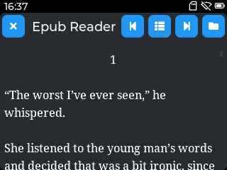
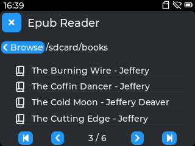
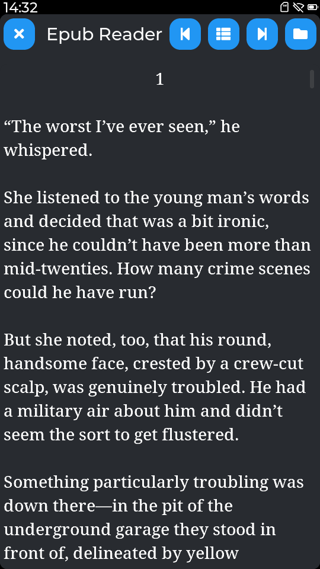
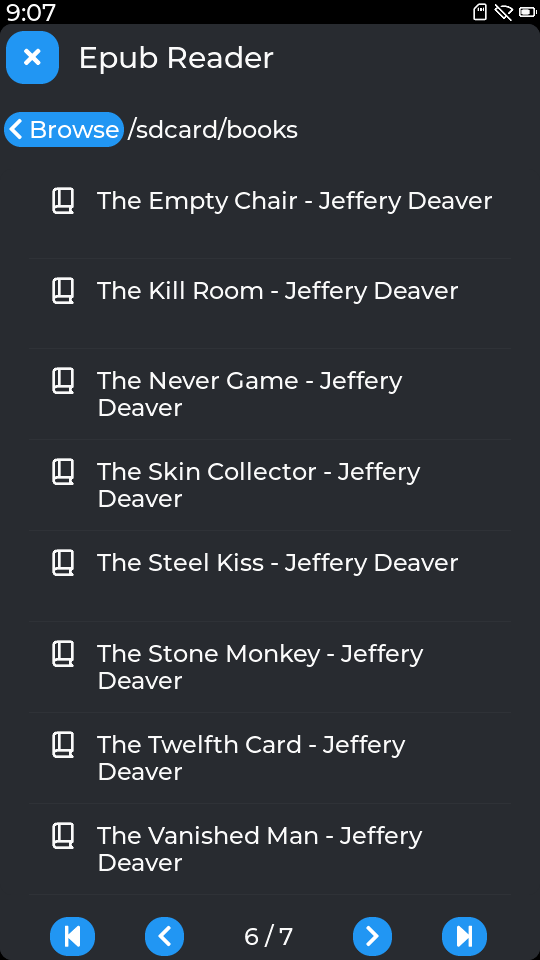

# Epub Reader

An EPUB and plain-text reader for Tactility devices.

## Features

- **EPUB support** - parses EPUB 2/3 files (OPF/NCX spine, HTML chapter content)
- **Plain-text support** - opens `.txt` files with the same scroll-based reader
- **Table of Contents** - in-app TOC dialog for direct chapter navigation
- **Reading progress** - automatically saves and restores your position per book
- **Scroll-based navigation** - Prev/Next buttons (and tap left/right half of screen) scroll by one viewport height, snapped to a whole line so text never starts mid-line
- **Chapter auto-skip** - image-only or blank chapters (common in EPUBs) are skipped automatically
- **Books shelf** - designate a folder as your library; the shelf lists all books across one level of subdirectories
- **Font rendering** - runtime-loaded Noto Serif fonts (4 weights: regular, italic, bold, bold-italic) in 4 size tiers to match the display resolution
- **Inline styling** - bold and italic runs within paragraphs are rendered correctly
- **Paragraph alignment** - center and right alignment from the EPUB source is preserved

## Screenshots

 

 

## Requirements

- **PSRAM is required.** The epub parser, font binaries, and LVGL allocations all live in PSRAM. The app will show an error and exit on devices without it.

## Supported File Types

| Extension | Notes |
|-----------|-------|
| `.epub`   | EPUB 2/3, ZIP-based |
| `.txt`    | Plain UTF-8 text |

## Fonts

Pre-built font binaries (Noto Serif) are bundled in `Apps/EpubReader/assets/` and included in the compiled `.app` package automatically - no setup required for most users.

### Generating your own fonts

You can regenerate the fonts (or substitute a different typeface) using the included `gen_fonts.py` script. The app loads files named `font_16pt_*.bin`, `font_20pt_*.bin`, `font_28pt_*.bin`, and `font_36pt_*.bin` from the assets directory - the names are font-family-agnostic, so any compliant set of binaries will work.

**Prerequisites:**
```
npm install -g lv_font_conv
```

**Font files** - edit `gen_fonts.py` to point `FONTS` at your chosen `.ttf` files and place them in `Apps/EpubReader/fonts/`. The default config expects Noto Serif (4 weights):
- `NotoSerif-Medium.ttf` → regular
- `NotoSerif-MediumItalic.ttf` → italic
- `NotoSerif-Bold.ttf` → bold
- `NotoSerif-BoldItalic.ttf` → bold italic

Four weights (regular, italic, bold, bold-italic) are required; all four size tiers (16, 20, 28, 36 pt) are required.

**Run:**
```
python Apps/EpubReader/gen_fonts.py
```

Output is written to `Apps/EpubReader/assets/`.

## Navigation

| Action | Result |
|--------|--------|
| Tap left half of screen | Previous page |
| Tap right half of screen | Next page |
| ⏮ / ⏭ toolbar buttons | Previous / next page |
| ☰ toolbar button | Table of Contents |
| 📁 toolbar button | Switch to file browser |
| Browser → tap folder | Navigate into folder |
| Browser → tap file | Open book |
| Shelf ◀ ▶ buttons | Page through book list |

## Books Folder / Shelf

In the file browser, navigate to any folder and tap the 📁 toolbar button to save it as your books folder. On subsequent launches the app opens directly to the shelf view for that folder, listing books from it and one level of subdirectories.

## Building

```
python tactility.py build
```

Or build, install, and run on a device:
```
python tactility.py bir <device-ip>
```
