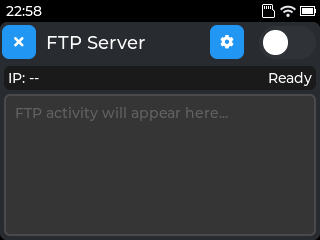
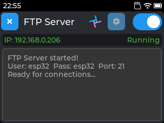
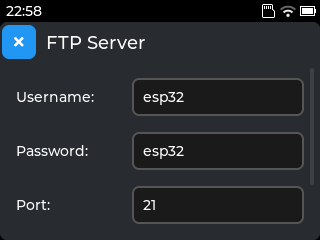
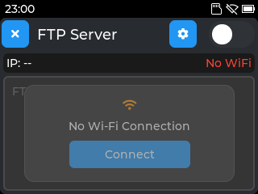

# FTP Server

An FTP server application for [Tactility](https://github.com/TactilityProject/Tactility) devices running on ESP32 platforms.

## Features

- Simple FTP server for wireless file transfer to/from your device
- Configurable username, password, and port
- Real-time connection status and activity logging
- Wi-Fi connection management

## Screenshots

| Idle | Running | Settings | No Wi-Fi |
|:----:|:-------:|:--------:|:--------:|
|  |  |  |  |

## Usage

1. Ensure your device is connected to Wi-Fi
2. Configure username, password, and port in settings (default: `esp32`/`esp32` on port `21`)
3. Toggle the switch to start the server
4. Connect using any FTP client with the displayed IP address

## Supported Platforms

- ESP32
- ESP32-S3
- ESP32-C6
- ESP32-P4

## Requirements

- Tactility SDK 0.7.0-dev or later
