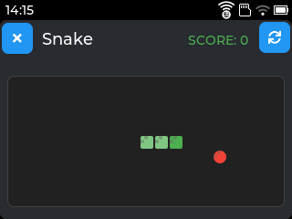
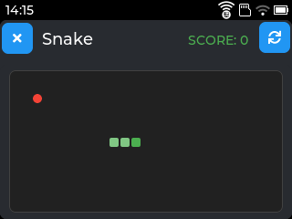
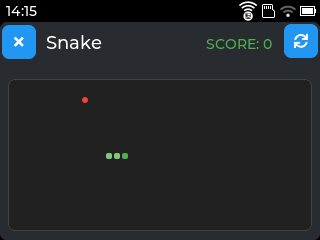
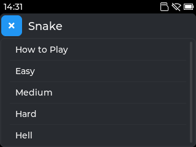

# Snake

The classic Snake game for Tactility.

## Overview

Snake is a faithful implementation of the classic arcade game where you control a snake that grows longer as it eats food. Navigate carefully to avoid hitting walls or your own tail!

## Features

- **Four Difficulty Levels**: Easy, Medium, Hard, and Hell - with wall collision toggle for the ultimate challenge.
- **Multiple Input Methods**: Touch gestures and keyboard support.
- **Visual Feedback**: Color-coded snake head and body with smooth movement.
- **Score Tracking**: Real-time score display with game over detection.
- **High Score Persistence**: Saves best scores for each difficulty level.
- **Progressive Speed**: Game speeds up as your snake grows longer.
- **Responsive UI**: Automatically adapts grid size to available screen space.
- **Non-Square Grids**: Takes advantage of the full display area.

## Screenshots

Screenshots taken directly from my Lilygo T-Deck Plus.
Tested on Lilygo T-Deck Plus and M5Stack Cardputer.

  

## Requirements

- Tactility
- Touchscreen or keyboard

## Usage

1. Launch the Snake app.
2. Optionally select "How to Play" to learn the controls.
3. Select your preferred difficulty (Easy, Medium, Hard, or Hell).
4. Control the snake to eat food and grow longer.
5. Avoid hitting yourself (and walls in Hell mode)!
6. Game ends when you collide - try to get the highest score!

## Controls

- **Touchscreen**: Swipe up, down, left, or right to change direction.
- **Keyboard (Arrow Keys)**: Use arrow keys (Up, Down, Left, Right) for movement.
- **Keyboard (WASD)**: Use W, A, S, D keys for movement.
- **Keyboard (Cardputer)**: Use semicolon (;), comma (,), period (.), slash (/) for up, left, down, right.

## Game Rules

- Snake starts in the center moving right.
- Eat food (red dot) to grow longer and increase score.
- Each food eaten adds one segment to your snake.
- Cannot reverse direction (no 180-degree turns).
- In Easy/Medium/Hard: Snake wraps around screen edges.
- In Hell mode: Hitting walls = instant death!
- Fill the entire grid to win (if you're that good)!

## Difficulty Levels

- **Easy**: Large cells (16px) - fewer cells, slower pace, wrap-around walls.
- **Medium**: Medium cells (12px) - balanced challenge, wrap-around walls.
- **Hard**: Small cells (8px) - many cells, requires quick reflexes, wrap-around walls.
- **Hell**: Small cells (8px) + wall collision - hitting walls means game over!

