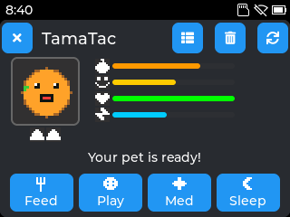
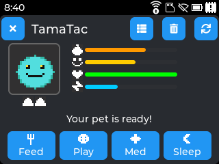
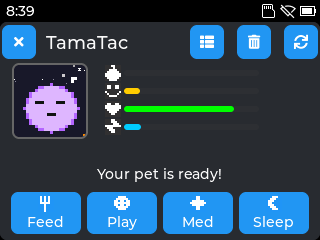
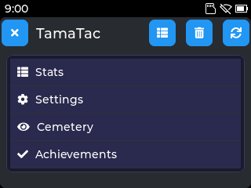
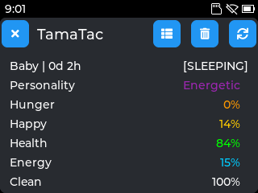
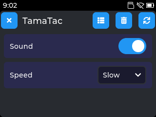
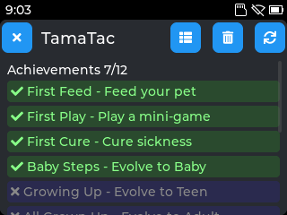

# TamaTac

A virtual pet game for Tactility OS, inspired by Tamagotchi and Tactiligotchi.

## About

TamaTac is a digital pet that lives in your ESP32 device. Feed it, play with it, keep it healthy, and watch it grow through different life stages. Your pet persists even when the app is closed, and stats decay while you're away.

## Features

### Core Pet System
- **5 Stats**: Hunger, Happiness, Health, Energy, Cleanliness (0-100%)
- **6 Life Stages**: Egg > Baby > Teen > Adult > Elder > Ghost
- **5 Personalities**: Energetic, Lazy, Glutton, Cheerful, Hardy — each affects stat decay rates
- **Automatic Decay**: Stats decay on a 30-second FreeRTOS timer
- **Configurable Speed**: Slow (0.5x), Normal (1x), Fast (2x) decay rates
- **Sickness**: Health below 20% triggers sick state
- **Death**: Health reaching 0 ends the game

### Actions
- **Feed**: Restores hunger (+30%), may cause poop (40% chance)
- **Play**: Randomly launches Simon Says or Reaction Time mini-game
- **Medicine**: Cures sickness (+30% health) or small boost (+5%)
- **Sleep**: Restores energy (+50%)
- **Clean**: Toolbar button clears all poop, restores cleanliness
- **Pet**: Tap the pet sprite for a small happiness boost (+5%, 3s cooldown)

### Day/Night Cycle
A 1-hour real-time cycle (30 min day / 30 min night):
- **Day**: Increased energy drain (more active)
- **Night**: Increased hunger drain (metabolism), auto-sleep when energy is critically low
- **Visual indicator**: Pet area background changes color between day and night
- MainView refreshes every 5 seconds to reflect changes

### Random Events
Random events occur during timer ticks (~12% chance per tick):
- **Found Treat**: +15 hunger
- **Made a Friend**: +15 happiness
- **Caught a Cold**: Pet gets sick, -10 health
- **Got Muddy**: -20 cleanliness
- **Had a Nap**: +15 energy
- **Sunny Day**: +10 happiness (day only)

Events are contextual — only eligible events trigger based on current stats.

### Mini-Games

#### Simon Says (Pattern Game)
- 4 colored buttons (red, blue, green, yellow) in a 2x2 grid
- Watch the sequence flash, then repeat it
- 3 rounds with increasing pattern length (starts at 3)
- **Win all 3 rounds**: +30 happiness, -10 energy, -5 hunger
- **Partial win (1-2 rounds)**: +10-20 happiness, -5 energy
- **Lose immediately**: +5 happiness, -5 energy

#### Reaction Time Game
- Large green circle target appears after a random delay (1-3.5 seconds)
- Tap as fast as possible when it appears
- Tapping too early = penalty round
- 3 rounds, scored by average reaction time
- Performance mapped to happiness reward

### Pet Cemetery
When your pet dies, it's remembered in the Cemetery:
- Stores up to 5 most recent pets (FIFO)
- Records personality, life stage reached, and age at death
- Accessible from the Menu

### Achievement System
12 achievements to unlock, stored as a bitfield:
- **First Feed**: Feed your pet
- **First Play**: Play a mini-game
- **First Cure**: Cure sickness
- **Baby Steps**: Evolve to Baby
- **Growing Up**: Evolve to Teen
- **All Grown Up**: Evolve to Adult
- **Wise Elder**: Evolve to Elder
- **Perfect Pet**: All stats >= 90%
- **Survivor**: Pet lives 24 hours
- **Pro Gamer**: Perfect mini-game score
- **Clean Freak**: Clean 10 times
- **Night Owl**: Play at night

### Persistence
- Auto-saves every 30 seconds and on every action
- All stats, state flags, and timestamps preserved
- **Time-Away Logic**: Calculates elapsed time since last save, applies decay (capped at ~50 minutes to prevent wipeout), ages pet, and checks evolution

### Sound
Uses the shared SfxEngine library:
- **SFX**: Unique sounds for Feed, Play, Medicine, Sleep, Clean actions; Chirp for tap-to-pet; mini-game sounds (Blip, Confirm, Error, Success)
- Sound toggle in Settings

### Responsive Scaling
Adapts to all Tactility screen sizes:
- **Small** (Cardputer 240x135, T-Dongle): Compact layout, 2x sprites
- **Medium** (T-Deck 320x240): Default layout, 3x sprites
- **Large** (480x320 panels): Spacious layout
- **XLarge** (800x480+): Full-size layout

### Views
- **Main View**: Pet sprite, stat bars with icons, action buttons, poop display, day/night visuals
- **Menu View**: Navigation to Stats, Settings, Cemetery, and Achievements
- **Stats View**: Detailed stats with exact values, age, life stage, personality
- **Settings View**: Sound toggle, decay speed selector
- **Pattern Game**: Simon Says mini-game
- **Reaction Game**: Reaction time mini-game
- **Cemetery View**: Hall of fame for past pets
- **Achievements View**: Progress tracker for all 12 achievements

### Animated Sprites
- 24x24 RGB565 full-color sprites with transparency (magenta color key)
- 12 animated pet sprites (2-3 frames each) for all life stages and states
- 9 monochrome 8x8 UI icons for stats and action buttons
- Canvas-rendered with responsive scaling (2x on small screens, 3x on medium+)
- Animation timer at ~5fps for smooth frame cycling

#### Sprite Preview

| Life Stages | | | | |
|:-:|:-:|:-:|:-:|:-:|
|  |  |  |  |  |
| Egg (cream) | Baby (pink) | Teen (blue) | Adult (green) | Elder (purple) |

| States | | | | | | |
|:-:|:-:|:-:|:-:|:-:|:-:|:-:|
|  |  |  |  |  |  |  |
| Happy | Sad | Sick | Eating | Playing | Sleeping | Ghost |

### Visual Polish
- **Evolution flash**: Brief white flash when pet evolves to a new life stage
- **Night sky**: Twinkling star dots in the pet area during night phase
- **Sleep Z's**: Floating animated Z characters while pet sleeps
- **Mood indicator**: Colored dot in pet area corner (green = happy, orange = warning, red = sick)

## How to Play

### Starting Out
- Your pet starts as an Egg with healthy stats
- After 1 hour it evolves to Baby, then Teen (8h), Adult (24h), Elder (72h)
- Keep stats above 30% to prevent sickness
- Tap the pet sprite anytime for a small happiness boost

### Daily Care
1. **Feed** when hunger drops below 50%
2. **Play** the mini-game to boost happiness
3. **Sleep** when energy is low
4. **Medicine** if pet gets sick
5. **Clean** poop from the toolbar button

### Evolution Timeline

| Stage | Age |
|-------|-----|
| Egg | 0-1 hour |
| Baby | 1-8 hours |
| Teen | 8-24 hours |
| Adult | 24-72 hours |
| Elder | 72+ hours |

## Building

```bash
cd Apps/TamaTac

# Build
python tactility.py build

# Build, install, and run
python tactility.py bir <device-ip>
```

## Project Structure

```text
TamaTac/
  CMakeLists.txt
  manifest.properties
  tactility.py
  main/
    CMakeLists.txt
    Source/
      main.cpp              # Entry point (registerApp)
      TamaTac.h/cpp         # Main app class, view management, action handlers
      MainView.h/cpp        # Pet display, stat bars, action buttons, day/night
      MenuView.h/cpp        # Navigation menu
      StatsView.h/cpp       # Detailed stats display (incl. personality)
      SettingsView.h/cpp    # Sound toggle and decay speed settings
      PatternGame.h/cpp     # Simon Says mini-game
      ReactionGame.h/cpp    # Reaction time mini-game
      CemeteryView.h/cpp    # Pet cemetery / hall of fame
      Achievements.h/cpp    # Achievement system (12 achievements)
      PetLogic.h/cpp        # Game mechanics, persistence, decay, events
      PetStats.h            # Data structures, enums, constants, thresholds
      Sprites.h             # Sprite/icon types, enums, 8x8 icon data
      SpriteData.h          # 24x24 RGB565 animated sprite pixel data
```

## Architecture

### View Management
TamaTac uses a multi-view pattern with a shared `wrapperWidget`. Views are swapped via `stopActiveView()` + `lv_obj_clean()` + `newView.onStart()`. Each view has `onStart()`/`onStop()` lifecycle methods.

### Key Components
- **TamaTac**: App lifecycle, view routing, action handlers, achievement triggers, static game state
- **PetLogic**: Stat management, decay, evolution, personality modifiers, day/night cycle, random events, save/load
- **MainView**: Animated pet canvas, stat bars, action buttons, tap-to-pet, day/night visuals, polish effects, 5s refresh timer
- **PatternGame**: Self-contained Simon Says with timer-based sequence display
- **ReactionGame**: Phase-based state machine (wait > target > result > final)
- **CemeteryView**: FIFO record storage for up to 5 past pets
- **AchievementsView**: Bitfield-based achievement tracking with 12 unlockables
- **SfxEngine**: Shared library for synthesized sound effects

### Save Data

| Namespace | Keys |
|-----------|------|
| `"TamaTac"` | `hunger`, `happiness`, `health`, `energy`, `cleanliness`, `poopCount`, `ageSeconds`, `ageHours`, `lifespan`, `isSick`, `isAsleep`, `isDead`, `stage`, `currentAnim`, `lastSaveTime`, `personality` |
| `"TamaTacCfg"` | `soundEnabled`, `decaySpeed` |
| `"TamaTacCem"` | `count`, `pers0..4`, `stage0..4`, `age0..4`, `valid0..4` |
| `"TamaTacAch"` | `bits` (uint16 bitfield), `cleanCnt` |

## Screenshots

| | | | |
|:-:|:-:|:-:|:-:|
|  |  |  |  |
| Main View | Poops! | Teen | Sleeping |
|  |  |  |  |
| Menu | Stats | Settings | Achievements |

## Known Issues

- **Offline time not tracked across reboots**: `lastSaveTime` uses uptime milliseconds (`tt::kernel::getMillis()`), which resets to 0 on device reboot. This means stat decay during power-off periods is not applied. A proper fix would require RTC or epoch-based timestamps, which are not currently available on all Tactility devices.

## Credits

- **Inspired by**: Tamagotchi (Bandai), Tactiligotchi (NellowTCS)
- **Built with**: TactilitySDK, LVGL, ESP-IDF, SfxEngine
- **Platform**: Tactility OS
