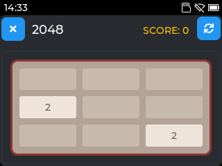
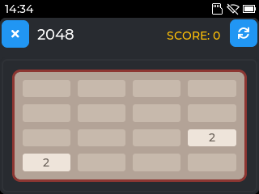
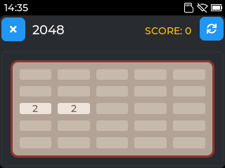
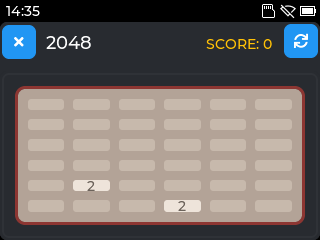
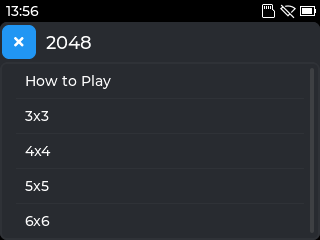

# Two Eleven (2048 Game)

A customizable 2048 sliding tile puzzle game for Tactility.
Named Two Eleven because numbers can be a pain in the butt with file names and 2^11=2048.

## Overview

TwoEleven is a faithful implementation of the popular 2048 game, where you slide numbered tiles to combine them and reach the 2048 tile. Unlike the standard 4x4 grid, this version allows you to choose grid sizes from 3x3 to 6x6, providing varying levels of challenge.

## Features

- **Configurable Grid Sizes**: Choose from 3x3 (easy), 4x4 (classic), 5x5 (moderate), or 6x6 (expert) grids.
- **Intuitive Controls**: Swipe gestures on touchscreens or use arrow keys for keyboard input.
- **Visual Feedback**: Color-coded tiles with smooth animations.
- **Score Tracking**: Real-time score display with win/lose detection.
- **High Score Persistence**: Saves best scores for each grid size.
- **Responsive UI**: Optimized for small screens with clean, modern design.
- **Thread-Safe**: Proper handling of UI updates to prevent crashes.

## Screenshots

Screenshots taken directly from my Lilygo T-Deck Plus.
Tested on Lilygo T-Deck Plus and M5Stack Cardputer.

  
 

## Requirements

- Tactility - obviously...
- Touchscreen or keyboard input

## Usage

1. Launch the 2048 app.
2. Select your preferred grid size (3x3 to 6x6).
3. Swipe tiles in any direction to move and combine them.
4. Reach the 2048 tile to win, or get stuck to lose.
5. Press the refresh button to restart with the same grid size.

## Controls

- **Touchscreen**: Swipe up, down, left, or right to move tiles.
- **Keyboard (Arrow Keys)**: Use arrow keys (Up, Down, Left, Right) for movement.
- **Keyboard (WASD)**: Use W, A, S, D keys for movement.
- **Keyboard (Cardputer)**: Use semicolon (;), comma (,), period (.), slash (/) for up, left, down, right.
- **New Game**: Press the refresh button in the toolbar to reset the board.

## Game Rules

- Start with random tiles (2 or 4).
- Slide tiles in four directions.
- Tiles with the same number merge when they collide.
- New tiles appear after each move.
- Game ends when you reach 2048 (win) or no moves are possible (lose).

